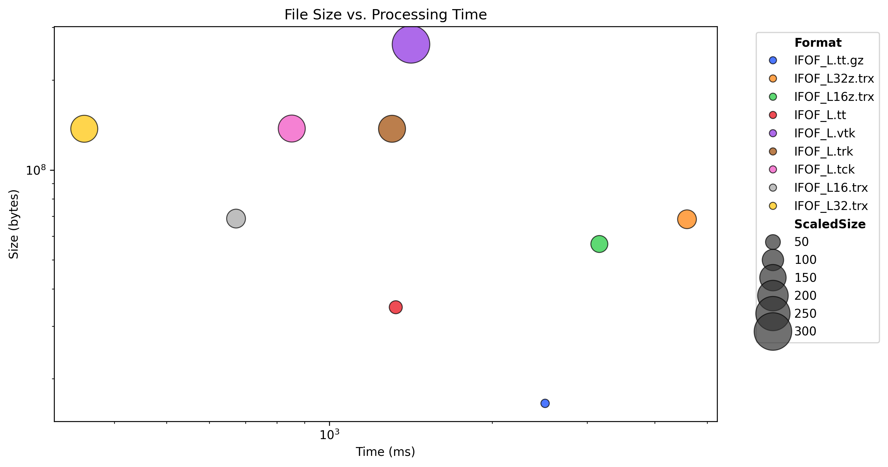

## About

This is a minimal JavaScript reader for the [TRX tractography file format](https://github.com/tee-ar-ex/trx-spec/blob/master/specifications.md). Previously, most tractography tools used their own proprietary [format](https://www.nitrc.org/plugins/mwiki/index.php/surfice:MainPage#Supported_Formats) such as BFLOAT, niml.tract, [PDB](https://github.com/vistalab/pdb_files), [TCK](https://mrtrix.readthedocs.io/en/latest/getting_started/image_data.html#tracks-file-format-tck), [TRK](http://trackvis.org/docs/?subsect=fileformat) and VTK. The TRX format was developed from community [discussions](https://github.com/nipy/nibabel/issues/942) to address the [limitations of the existing formats](https://docs.google.com/document/d/1GOOlG42rB7dlJizu2RfaF5XNj_pIaVl_6rtBSUhsgbE/edit#heading=h.c6igqydj1hrf) and the needs of the users. This reader supports all the features of TRX including data-per-vertex, data-per-streamline and groups.

## Live Demo

[NiiVue provides a WebGL live demo of this code](https://niivue.github.io/niivue/features/tracts.html). This can be tested on any device (computer, laptop, phone). A sample TRX file is loaded by default, but users can drag and drop new streamlines in the niml.tract, TCX, TRK, TRX, and VTK formats.

## Node.JS Command Line Demo

The node command line program `bench.mjs` allows you to load a streamline 11 times and reporting details regarding file size, loading time, and streamline properties.

When you first install this repository, run `npm run cli` to convert the typescript to javascript and test the conversion. Subsequently, you can run `node bench.mjs /path/to/streamline.trx`.

```
$ git clone https://github.com/tee-ar-ex/trx-javascript
$ cd trx-javascript
$ npm install
$ node run cli
> node bench.mjs dpsv.trx
dpsv.trx	Size	626180	Time	125
Vertices:95865
 First vertex (x,y,z):-24.25,-22.09375,-26.90625
Streamlines: 459
 Vertices in first streamline: 208
dpg (data_per_group) items: 0
dps (data_per_streamline) items: 1
  'DataSetID' items: 460
dpv (data_per_vertex) items: 1
  'z' items: 95865
Header (header.json):
{
  DIMENSIONS: [ 314, 378, 272 ],
  VOXEL_TO_RASMM: [
    [ 0.5, -0, 0, -78.5 ],
    [ -0, 0.5, 0, -112.5 ],
    [ -0, -0, 0.5, -50 ],
    [ 0, 0, 0, 1 ]
  ],
  NB_VERTICES: 95865,
  NB_STREAMLINES: 460
}

```

## Implementation Details

There are several important considerations regarding supporting the TRX format with JavaScript. The provided minimal reader makes some tradeoffs that may not be appropriate for all use cases. JavaScript does not natively support 32-bit integers, so this library is limited to a maximum of 4 billion streamlines. The TRX [specification](https://github.com/tee-ar-ex/trx-spec/blob/master/specifications.md) allows streamline positions to use the float16 datatype, which is not native to JavaScript, therefore these are converted to float32.

## Benchmark

This repository includes a benchmark to evaluate performance. This benchmark is likely specific to JavaScript and so be careful in evaluating relative performance. Further, it is specific to node, and one may see different performance in different forms of web browser. The script will report the times to TRK, TCK, VTK or TRX file 10 times (it loads the tracts 11 times, and ignores the first run). You can run this benchmark on your own machine by [downloading the data from OSF](https://osf.io/8aq9e/):

```bash
$ git clone https://github.com/tee-ar-ex/trx-javascript
$ cd trx-javascript
$ npm install
$ node run cli
$ wget --content-disposition https://osf.io/dq374/download
$ unzip IFOF_L.zip
$ npm run bench
```
The graph below shows the time load the [left inferior fronto-occipital fasciculus (IFOF) ](https://brain.labsolver.org/hcp_trk_atlas.html) from the HCP1065 Population-Averaged Tractography Atlas (Yeh, 2022). This has with 21209 streamlines and 4915166 vertices. The different formats are generated with the [tff_convert_tractogram.py](https://github.com/tee-ar-ex/trx-python) script. The benchmark was run on a MacBook Air M2 laptop. The ideal format would be both fast to load (to the left on the horizontal axis) and have a small file size (toward the bottom in the right axis). However, compression typically trades load time for file size. Here all data is loaded from a local solid state drive, whereas smaller files would benefit if data was loaded using a slow internet connection. The following file formats are illustrated (except where noted, both positions and indices are stored with 32-bit precision):

 - tt: The [DSI Studio format](https://dsi-studio.labsolver.org/doc/cli_data.html) is very compact. The vertex position is stored as 1/32nd of a voxel, so it may be slightly lossy for some use cases.
 - tt.gz: Gzip compressed DSI-Studio.
 - vtk: streamlines saved by an [undocumented](https://discourse.vtk.org/t/upcoming-changes-to-vtkcellarray/2066) extension to the [VTK legacy file format](https://vtk.org/wp-content/uploads/2015/04/file-formats.pdf) (converted with `--offsets_dtype uint32`).
 - tck: [MRtrix format](https://mrtrix.readthedocs.io/en/latest/getting_started/image_data.html#tracks-file-format-tck).
 - trk: The popular [TrackVis format](http://trackvis.org/docs/?subsect=fileformat).
 - 16.trx: uncompressed TRX format with 16-bit precision vertex positions.
 - 16z.trx: zip-compressed TRX format with 16-bit precision vertex positions.
 - 32.trx: uncompressed TRX format with 32-bit precision vertex positions.
 - 32z.trx: zip-compressed TRX format with 32-bit precision vertex positions.


